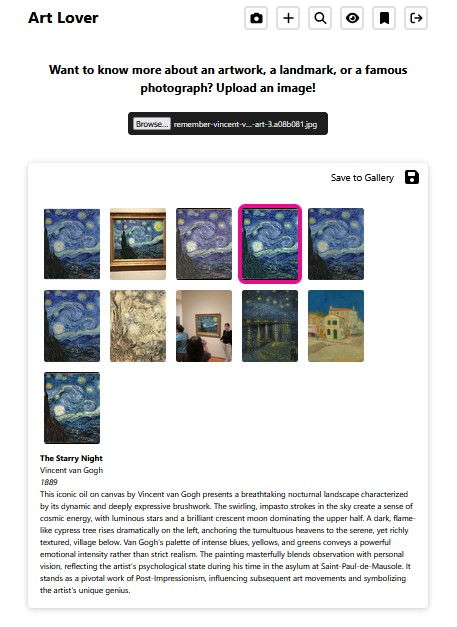
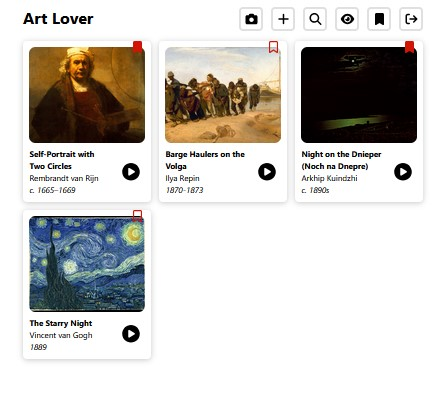
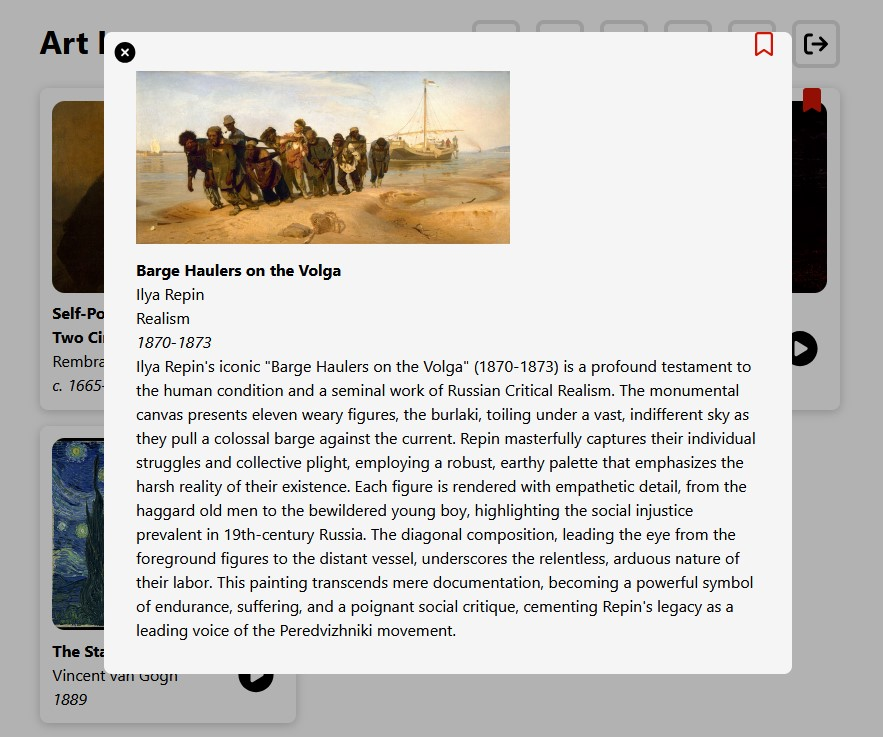

# ART LOVER APP (in progress)

As an art enthusiast, I enjoy learning about artworks beyond simply viewing an image, including their historical context, artistic movements, and the stories behind them. However, museum descriptions are often limited to brief blurbs or basic facts such as the title, artist, country, and year of creation, which can feel disappointing and, at times, elitist—serving primarily those who already know a great deal about art.

To address this gap, I created **Art Lover**, an app designed to help art enthusiasts enjoy and understand art on the spot, without the need to search the web or jump between multiple pages while standing in a museum.

The Art Lover app is currently **web-based**, with **native mobile versions for iOS and Android planned**. It allows users to explore artworks through image uploads and keyword searches. By uploading an image of a painting, users receive the artist’s name, artwork title, artistic movement, historical period, and an AI-generated description that highlights the work’s stylistic and semantic features, as well as its contribution to the art world.

Users can explore further by clicking **Learn More** buttons to access additional information about the artist, movement, period, or artwork itself. For a more immersive experience, users can press **Play** to listen to the generated descriptions while viewing the artwork. Identified artworks and their generated descriptions can be saved to a personal gallery for later enjoyment.

---

## Tech Stack

- **Frontend:** React.js (TypeScript)
- **Backend:** Java, Spring Boot
- **AI Services:** Gemini (AI description and image recognition)
- **Database:** MongoDB Atlas
- **Cloud Storage:** Cloudflare R2
- **External APIs:** The MET Museum API, Rijksmuseum API, Smithsonian Museum API, Europeana API, and Wikimedia Commons API for cultural heritage and artwork data
- **Deployment:** AWS EC2 (Java Spring Boot backend), Amazon S3 + Cloudfront (React frontend)

---

## API Endpoints

### Authentication

| Method | Endpoint           | Description                       |
| ------ | ------------------ | --------------------------------- |
| POST   | `/api/auth/signup` | Create a new user account         |
| POST   | `/api/auth/login`  | Login and receive JWT cookie      |
| POST   | `/api/auth/logout` | Logout and clear JWT cookie       |
| GET    | `/api/auth/me`     | Get current authenticated user ID |

---

### Artworks

| Method | Endpoint                    | Description                                        |
| ------ | --------------------------- | -------------------------------------------------- |
| POST   | `/api/save`                 | Add a new artwork (multipart form, optional image) |
| GET    | `/api/show`                 | Get all artworks for authenticated user            |
| GET    | `/api/show/{id}`            | Get a single artwork by ID                         |
| PATCH  | `/api/update/{id}`          | Update artwork details and image                   |
| DELETE | `/api/delete/{id}`          | Delete an artwork                                  |
| PATCH  | `/api/update/bookmark/{id}` | Bookmark or unbookmark an artwork                  |

---

### Artists

| Method | Endpoint       | Description     |
| ------ | -------------- | --------------- |
| GET    | `/api/artists` | Get all artists |

---

### Search and AI

| Method | Endpoint                                | Description                           |
| ------ | --------------------------------------- | ------------------------------------- |
| GET    | `/api/generate-description?userPrompt=` | Generate AI artwork description       |
| POST   | `/api/recognize`                        | Recognize artwork from uploaded image |
| POST   | `/api/recognize-keywords`               | Recognize artwork from user keywords  |

---

## Recent Updates

- **Gemini AI–Powered Search**: Finds artworks by uploading an image or searching with keywords.
- **Camera Snapshot Upload**: Allows users to capture and upload artwork images directly from the camera on mobile devices.
- **Filter out non-image media**: Excludes non-bitmap Wikimedia Commons files (e.g., PDF, DJVU) by filtering on mediatype=BITMAP and image/\* MIME types.
- **Face-Focused Image Preview**: Automatically centers detected faces in gallery preview images to improve visual framing (powered by Gemini image recognition for face and bounding box detection).
- **Full-Screen Image Viewer**: Provides an expanded viewing experience in an immersive, distraction-free full-screen mode.
- **Text-to-Speech:** Enables text-to-speech for artwork descriptions in the full view card
- **Testing:** Adds JUnit 5 tests for controller endpoints

## Future Improvements

- **Native Mobile Apps**: iOS and Android applications to enable on-the-spot artwork exploration in museums.
- **Learn More Enhancements**: Expand and enrich detailed content for artworks, artists, movements, and periods.
- **Fun Facts Feature**: Provide random, engaging facts related to an artwork.
- **Authorization & Authentication**: Add email-based OTP verification during user sign-up to validate user identity.
- **Testing**: Added React component and interaction tests, along with Spring Boot service and controller tests to validate core application behavior.

## Screenshots

### Artwork Recognition

### Gallery View

### Details View

