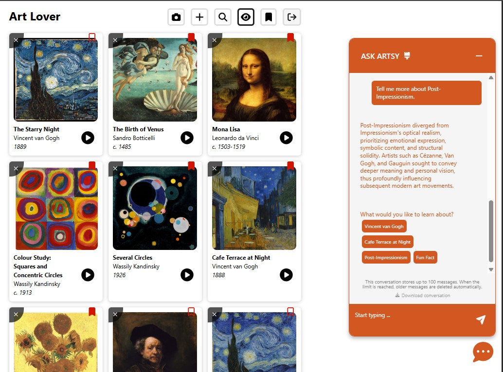

# ART LOVER APP (in progress)

**Art Lover** is a full-stack web application that helps users understand artworks beyond basic museum labels by combining image recognition, AI-generated context, and curated art history data.

### Key Features

- Upload an artwork image or search by keywords to identify the artwork and artist
- Generate AI descriptions covering artistic style, movement, historical context, and significance
- Listen to artwork descriptions via text-to-speech for hands-free exploration
- Save, bookmark, and manage artworks in a personal gallery
- Explore artworks further using an AI chatbot powered by Retrieval-Augmented Generation (RAG) and trained on authoritative art history sources

---

## Tech Stack

- **Frontend:** React.js (TypeScript)
- **Backend:** Java, Spring Boot
- **AI Services:** Gemini (AI description and image recognition)
- **Database:** MongoDB Atlas with Vector Search
- **Cloud Storage:** Cloudflare R2
- **External APIs:** The MET Museum API, Rijksmuseum API, Smithsonian Museum API, Europeana API, and Wikimedia Commons API
- **Testing:** Playwrite (E2E), JUnit5 (Spring Boot endpoints)
- **Deployment:** AWS EC2 (Java Spring Boot backend), Amazon S3 + Cloudfront (React frontend)

---

## Live Demo

The application is deployed on AWS but the instance is currently paused for cost reasons.  
I am happy to spin it up on request.

---

## API Endpoints

### Authentication

| Method | Endpoint           | Description                       |
| ------ | ------------------ | --------------------------------- |
| POST   | `/api/auth/signup` | Create a new user account         |
| POST   | `/api/auth/login`  | Login and receive JWT cookie      |
| POST   | `/api/auth/logout` | Logout and clear JWT cookie       |
| GET    | `/api/auth/me`     | Get current authenticated user ID |

---

### Artworks

| Method | Endpoint                    | Description                                        |
| ------ | --------------------------- | -------------------------------------------------- |
| POST   | `/api/save`                 | Add a new artwork (multipart form, optional image) |
| GET    | `/api/show`                 | Get all artworks for authenticated user            |
| GET    | `/api/show/{id}`            | Get a single artwork by ID                         |
| PATCH  | `/api/update/{id}`          | Update artwork details and image                   |
| DELETE | `/api/delete/{id}`          | Delete an artwork                                  |
| PATCH  | `/api/update/bookmark/{id}` | Bookmark or unbookmark an artwork                  |

---

### Artists

| Method | Endpoint       | Description     |
| ------ | -------------- | --------------- |
| GET    | `/api/artists` | Get all artists |

---

### Chatbot

| Method | Endpoint             | Description                              |
| ------ | -------------------- | ---------------------------------------- |
| GET    | `/api/chat/messages` | Get all chat messages per user           |
| POST   | `/api/chat/save`     | Add a new message to a chat conversation |

---

### Search and AI

| Method | Endpoint                                | Description                           |
| ------ | --------------------------------------- | ------------------------------------- |
| GET    | `/api/generate-description?userPrompt=` | Generate AI artwork description       |
| POST   | `/api/recognize`                        | Recognize artwork from uploaded image |
| POST   | `/api/recognize-keywords`               | Recognize artwork from user keywords  |

---

## Recent Updates

- **Gemini AI–Powered Search**: Finds artworks by uploading an image or searching with keywords.
- **Camera Snapshot Upload**: Allows users to capture and upload artwork images directly from the camera on mobile devices.
- **Filter out non-image media**: Excludes non-bitmap Wikimedia Commons files (e.g., PDF, DJVU) by filtering on mediatype=BITMAP and image/\* MIME types.
- **Face-Focused Image Preview**: Automatically centers detected faces in gallery preview images to improve visual framing (powered by Gemini image recognition for face and bounding box detection).
- **Full-Screen Image Viewer**: Provides an expanded viewing experience in an immersive, distraction-free full-screen mode.
- **Text-to-Speech:** Enables text-to-speech for artwork descriptions in the full view card
- **AI Chatbot**: Improve user learning and engagement by incorporating authoritative art history training materials (textbooks, articles, PDFs) and using Retrieval-Augmented Generation (RAG) to produce responses grounded in this curated content.
- **Testing:** Includes JUnit 5 tests for Spring Boot controllers and Playwright E2E tests for the React frontend.

## Screenshots

### Artwork Recognition

### Gallery View

### Details View

### AI Chatbot

